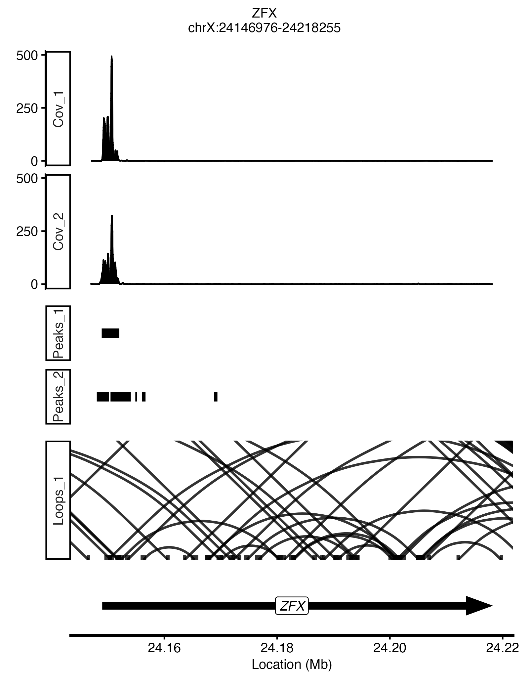
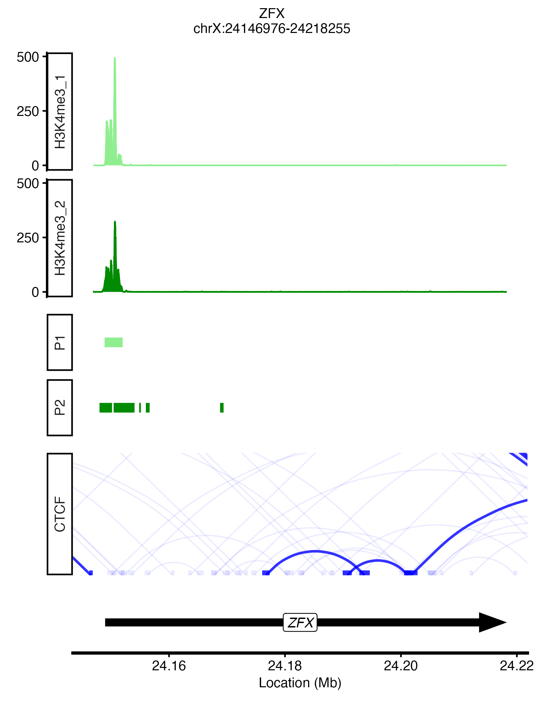
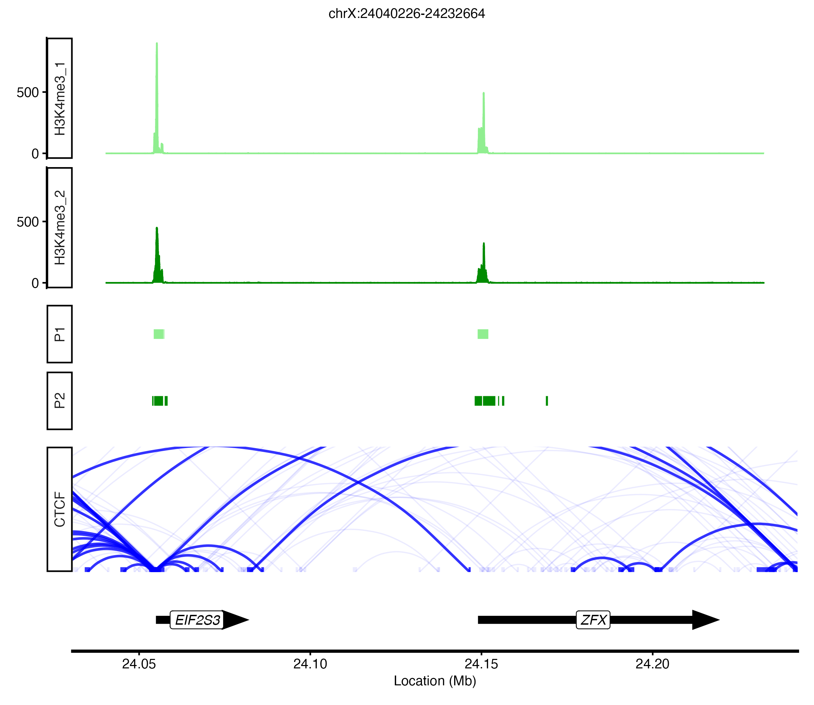
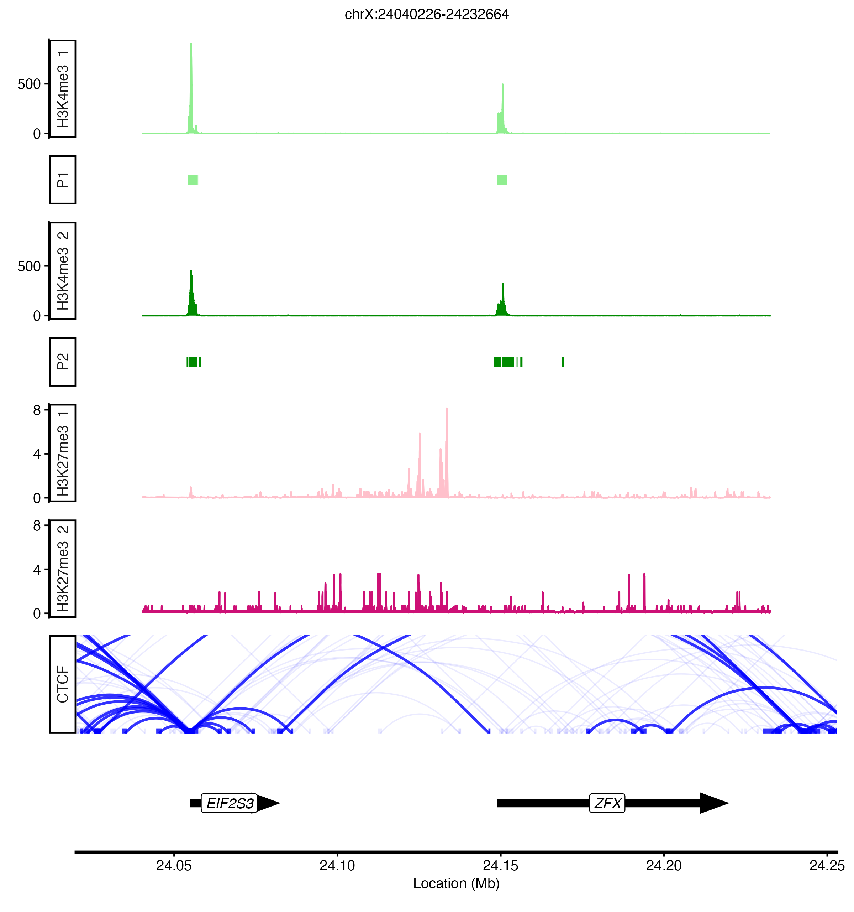
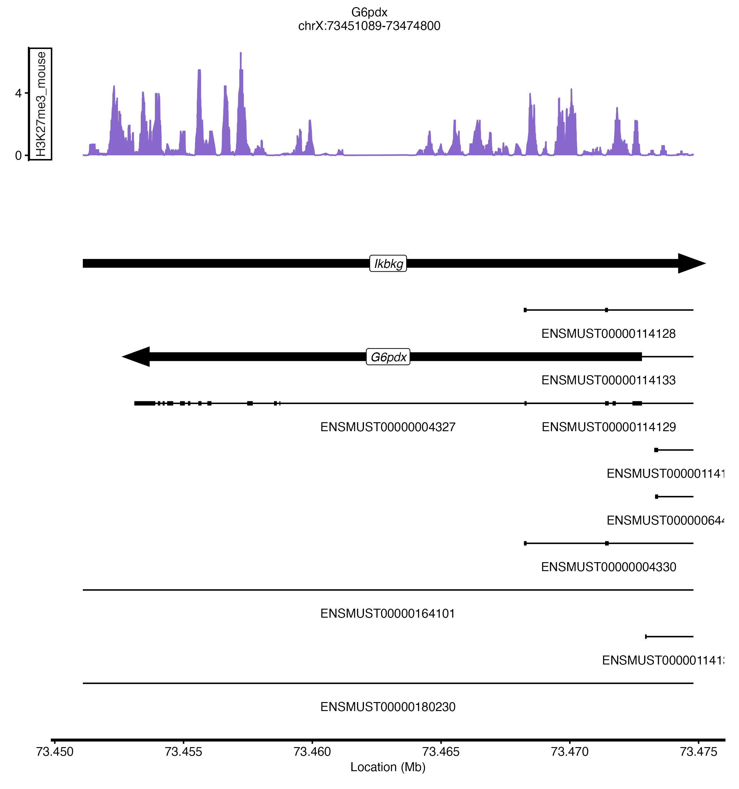

# trackDJ

TrackDJ: a programmable visualization tool for reproducible epigenomic figure generation in R


## Description
Visualize chromatin tracks across the genome

Ready to make tracks for your paper? Instead of screenshotting IGV, or uploading tracks to UCSC genome browser, try this function for streamlining and beautify-ing your figures. 

## Installation

You can install the development version of this package directly from GitHub. 

First, make sure you have the ```remotes``` package installed and loaded:
```{r}
install.packages("remotes")
library(remotes)
```
Then install this package from GitHub:
```{r}
remotes::install_github("neha-bokil/trackDJ")
```
Finally, load the package:
```{r}
library(trackDJ)
```

Optional: if you'd like to try out the examples, you will need to download some files from ENCODE. I've provided a script to do so. In the command line, run:
```{}
./extraScripts/download_encode_files.sh ENCFF144MRB ENCFF405ZDL ENCFF188SZS ENCFF961SPZ ENCFF118PBQ ENCFF511QFN ENCFF470HOG ENCFF665RDD ENCFF727HQD

gunzip ENCFF188SZS.bed.gz ENCFF961SPZ.bed.gz ENCFF118PBQ.bedpe.gz ENCFF511QFN.bedpe.gz
```

## Usage

This tool is made for use in R. 

As input, you will need (at minimum):

* ```genomicLoc```: gene name or chromosomal coordinates of the region you are interested in
    * if you are using a gene name, simply enter it in quotes (eg. "ZFX")
    * if you want to specify using coordinates, provide a vector c(chromosome, start coordinate, end coordinate). chromosome can include "chr" at the beginning but does not have to (so both "chrX" and "X" are fine if you want to look at the X chromosome)
    * Specifying the annotation
      * ```ensembl_set```: Ensembl annotation to use (default="hsapiens_gene_ensembl")
        * most ensembl sets follow this format, for example if you're using mouse it would be "mmusculus_gene_ensembl"
        * ```mart```: if needed, this program will look up all of the annotation information for you; however, this takes time. Additionally, the ensembl server is sometimes down, in which case you'd need to set up a mirror. To get around this problem, you can provide a ```mart``` obtained by utilizing the ```useMart``` function, where you can specify the dataset and site. if making multiple plots, I highly recommend importing the mart first and then specifying it when you run the function--that way, it only has to be imported once. 
        * ```gene_symbol``` :nomenclature system you are using for genes (default="hgnc_symbol")
          * note that "hgnc_symbol" is for humans only. if ```ensembl_set``` is anything other than "hsapiens_gene_ensembl", the default is "external_gene_name". if you are using other nomenclature systems you must specify
      * ```custom_anno```: file path to a .gtf/.gff if using a custom annotation rather than ensembl.
          * if you are making multiple plots, you can import the file once using the  ```import``` function in rtracklayer and pass the imported object as ```custom_anno```. This way, you won't be importing a large genome file every time you are making a new plot. 

You'll also need any chromatin data you'd like to visualize (you do not need all three)

* ```covFiles```: character vector containing a list of file paths to any coverage files (typically in bigWig or bedGraph format)
  * minimum score can be set with ```ymin``` ; maximum score can be set with ```ymax``` 
* ```peakFiles```: character vector containing a list of file paths to any peak files (.bed format)
* ```loopFiles```: character vector containing a list of file paths to any contact/loop files (.bedpe format)

Run:
```{r}
myPlot<-plot_genomic_tracks(genomicLoc, covFiles, peakFiles, loopFiles)
```
Running ```plot_genomic_tracks``` will return 6 total objects:
* plotTitle: title of the figure
* coveragePlot: ggplot for the coverage tracks
* peakPlot: ggplot for the peak tracks
* loopPlot: ggplot for the loop tracks
* genePlot: ggplot for the genome track
* figure: patchwork plot with all tracks combined

In addition to ```plot_genomic_tracks```, which keeps tracks of the same type together, there is a function called ```trackDJ``` that allows you to specify the order of each individual track in the figure. 

To run ```trackDJ```, you will need:
* ```plotList```: a list of outputs from ```plot_genomic_tracks``` that have all the tracks you want to reorder
* ```plotOrder```: character vector specifying the order of each track, using the names you provided to ```plot_genomic_tracks```

Run:
```{r}
myPlot_ordered<-trackDJ(plotList, plotOrder)
```

Running ```trackDJ``` returns the following:
* singlePlots: list of ggplot objects where each item is an individual track
  * within this list, each item is named as its track name that was provided in ```trackDJ```
* figure: patchwork plot with all tracks combined in the order you specified

Additional parameters, such as how to specify colors, labels, order, etc., are described in/after the examples.

## Examples
These examples use data from the ENCODE project (https://www.encodeproject.org/)

* ENCFF144MRB.bigWig; ENCFF405ZDL.bigWig are coverage tracks from H3K4me3 ChIP-seq
* ENCFF470HOG.bigWig; ENCFF665RDD.bigWig are coverage tracks from H3K27me3 ChIP-seq
* ENCFF188SZS.bed; ENCFF188SZS.bed are peak calls from H3K4me3 ChIP-seq
* ENCFF118PBQ.bedpe is a loop track from a CTCF ChIA-PET
```{r}

# filepaths for coverage tracks (this will be our ```covFiles```)

k4me3_coverageTracks<-c("ENCFF144MRB.bigWig","ENCFF405ZDL.bigWig")

# filepaths for peak tracks (this will be our ```peakFiles```)

k4me3_peakTracks<-c("ENCFF188SZS.bed","ENCFF961SPZ.bed")

# filepaths for contact/loop tracks (this will be our ```loopFiles```)

ctcf_contactFiles<-"ENCFF118PBQ.bedpe"

#optional: import mart
# I highly recommend importing the mart first and then specifying it when you run the function--that way, it only has to be imported once rather than every single time you run plot_genomic_tracks for the same annotation. 

mart<-useMart("ensembl", dataset="hsapiens_gene_ensembl")


#plot genomic tracks
#let's plot ZFX
```{r}
zfx_plot1<-plot_genomic_tracks(genomicLoc="ZFX", mart=mart,
                               covFiles = k4me3_coverageTracks, 
                               peakFiles = k4me3_peakTracks,
                               loopFiles = ctcf_contactFiles)
print(zfx_plot1$figure)

```



Colors and/or labels can be specified for each track, and loops under a provided score threshold can be made lighter:
```{r}
zfx_plot2<-plot_genomic_tracks(genomicLoc="ZFX", mart=mart, 
                               covFiles =k4me3_coverageTracks, covTrackNames =c("H3K4me3_1","H3K4me3_2"), covTrackColors=c("palegreen2","green4"), 
                               peakFiles=k4me3_peakTracks,peakTrackNames=c("P1","P2") ,peakTrackColors=c("palegreen2","green4") ,
                               loopFiles=ctcf_contactFiles, loopTrackNames=c("CTCF"), loopTrackColors="blue", minScore=5)

print(zfx_plot_2$figure)

```



You can label and/or color specific peaks differently using ```specialPeaks```, ```labelSpecialPeaks```, and ```specialPeakColors```:
```{r}
zfx_plot3<-plot_genomic_tracks(genomicLoc="ZFX", mart=mart, 
                               covFiles =k4me3_coverageTracks, covTrackNames =c("H3K4me3_1","H3K4me3_2"), covTrackColors=c("palegreen2","green4"), 
                               peakFiles=k4me3_peakTracks,peakTrackNames=c("P1","P2") ,peakTrackColors=c("palegreen2","green4")  ,
                               labelSpecialPeaks = TRUE, specialPeaks=c("Peak_14307","Peak_6002"), specialPeakColors="goldenrod2",
                               loopFiles=ctcf_contactFiles, loopTrackNames=c("CTCF"), loopTrackColors="blue", minScore=5)

print(zfx_plot_3$figure)

```


You can plot transcripts by setting ```includeTranscripts=TRUE```: 

```{r}
zfx_plot4<-plot_genomic_tracks(genomicLoc="ZFX", mart=mart, includeTranscripts = TRUE,
                               covFiles =k4me3_coverageTracks, covTrackNames =c("H3K4me3_1","H3K4me3_2"), covTrackColors=c("palegreen2","green4"), 
                               peakFiles=k4me3_peakTracks,peakTrackNames=c("P1","P2") ,peakTrackColors=c("palegreen2","green4")  ,
                               loopFiles=ctcf_contactFiles, loopTrackNames=c("CTCF"), loopTrackColors="blue", minScore=5)
print(zfx_plot_4$figure)
```


Note: if you only want to include specific transcripts, you can specify them with ```transcript_list```. Alternatively, if you only want to include the canonical transcript, set ```canonicalTranscriptOnly``` to TRUE. See the additional notes for more ways to filter transcripts. 

Instead of a gene name, you can use coordinates:
```{r}
coord_plot1<-plot_genomic_tracks(genomicLoc=c("X",24040226,24232664), mart=mart, 
                               covFiles =k4me3_coverageTracks, covTrackNames =c("H3K4me3_1","H3K4me3_2"), covTrackColors=c("palegreen2","green4"), 
                               peakFiles=k4me3_peakTracks,peakTrackNames=c("P1","P2") ,peakTrackColors=c("palegreen2","green4")  ,
                               loopFiles=ctcf_contactFiles,
                               loopTrackNames=c("CTCF"), loopTrackColors="blue", minScore=5)
print(coord_plot1$figure)

```



Okay, what if we want a different order?

If you still want the same types of tracks (coverage, peaks, and loops) grouped together, you can use ```trackOrder_type``` in ```plot_genomic_tracks```. You can also change the orientation of loops to be below the horizontal instead of above it:

```{r}
coord_plot2<-plot_genomic_tracks(genomicLoc=c("X",24040226,24232664), mart=mart, 
                                 covFiles =k4me3_coverageTracks, covTrackNames =c("H3K4me3_1","H3K4me3_2"), covTrackColors=c("palegreen2","green4"), 
                                 peakFiles=k4me3_peakTracks,peakTrackNames=c("P1","P2") ,peakTrackColors=c("palegreen2","green4")  ,
                                 loopFiles=ctcf_contactFiles, loopTrackNames=c("CTCF"), loopTrackColors="blue", minScore=5, loop_orientation = "below",
                                 trackOrder_type = c("genome","loops","coverage","peaks"))
print(coord_plot_2$figure)

```


The ```trackDJ``` serves two purposes. 
You can order the tracks one-by-one; they do not need to be grouped by their track type as they are in  ```plot_genomic_tracks ```. 
Additionally, since  ```plot_genomics_tracks ``` plots all coverage tracks on the same level, you need to run it more than once if you are working with tracks of different scales.  ```trackDJ ``` can combine these into one figure. 
You can specify the order of the tracks with ```plotOrder```

```{r}
#make plots with ```plot_genomic_tracks``` like we did before:
firstPlot<-plot_genomic_tracks(genomicLoc=c("X",24040226,24232664), mart=mart, 
                                 covFiles =k4me3_coverageTracks, covTrackNames =c("H3K4me3_1","H3K4me3_2"), covTrackColors=c("palegreen2","green4"), 
                                 peakFiles=k4me3_peakTracks,peakTrackNames=c("P1","P2") ,peakTrackColors=c("palegreen2","green4")  ,
                                 loopFiles=ctcf_contactFiles,
                                 loopTrackNames=c("CTCF"), loopTrackColors="blue", minScore=5)

secondPlot<-plot_genomic_tracks(genomicLoc=c("X",24040226,24232664), mart=mart, 
                                covFiles =k27me3_coverageTracks, covTrackNames =c("H3K27me3_1","H3K27me3_2"), covTrackColors=c("pink","deeppink3"))

#put them all together with  ```trackDJ ```
finalPlot<-trackDJ(plotList=list(firstPlot, secondPlot), plotOrder=c("H3K4me3_1","P1","H3K4me3_2","P2","H3K27me3_1","H3K27me3_2", "CTCF","genome"))

print(finalPlot$figure)
```



## Additional (optional) parameters for each data type in ```plot_genomic_tracks```

* for coverage tracks: 
  * ```covTrackNames```: character vector containing the label of each coverage track. Should be the same length as ```covFiles``` and in the same order. By default it will label them as "Cov_1", "Cov_2", etc
  * ```covTrackColors```: character vector containing the color of each coverage track. If only one color is provided, all tracks will be that color. If different tracks must be different colors, specify the color for each track in order. By default, all tracks will be "grey"
  * ```ymin```: numeric, minimum value for y-axis (default=0)
  * ```ymax```: numeric, maximum value for y-axis (default=1)
  * ```logScale```: boolean, set this to TRUE if you want data plotted on a log scale (default=FALSE)
  * ```fillArea```: boolean, switch this to FALSE if you don't want your coverage plot to be filled in with color (default=TRUE)
  * ```rasterizeCovPlot```: boolean, set this to TRUE if you want to rasterize the coverage plot. This can be useful as coverage files can be rather large, and that can mess up the plot when you save it as an .svg file. (default=FALSE)
 
* for peak tracks:
  * ```peakTrackNames```: character vector containing the label of each peak track. Should be the same length as ```peakFiles``` and in the same order. By default it will label them as "Peaks_1", "Peaks_2", etc
  * ```peakTrackColors```: character vector containing color of each peak track. If only one color is provided, all tracks will be that color. If different tracks must be different colors, specify the color for each track in order. By default, all tracks will be "grey"
  * ```labelAllPeaks```: boolean, set to TRUE if each individual peak should be named. assumes names are provided in the fourth column of a given .bed file
  * ```specialPeaks```: character vector listing the names of specific peaks you want to either label or put in a different color
  * ```labelSpecialPeaks```: boolean, set to TRUE if each special peak should be named. requires ```specialPeaks``` to be specified
  * ```specialPeakColors```: character vector containing the color(s) you want to give your special peaks. requires ```specialPeaks``` to be specified
  * ```labelStrand```: boolean, set to TRUE if the strand of each peak should be indicated. assumes strand information is in the sixth column of a given .bed file or dataframe
  * ```strandColors```: character vector of length 2. First is the color for the + strand, the second is the color for the - strand. overrides peakTrackColors but does NOT override specialPeakColors

 
* for contact/loop tracks:
  * ```loopTrackNames```: character vector containing the label of each loop track. Should be the same length as contactFiles and in the same order. By default it will label them as "Loops_1", "Loops_2", etc
  * ```loopTrackColors```: character vector containing color of each loop track. If only one color is provided, all tracks will be that color. If different tracks must be different colors, specify the color for each track i order. By default, all tracks will be "grey"
  * ```lineSize```: numeric, width of lines used to draw loops
  * ```alpha```: numeric, alpha value (transparency) for loops
  * ```minScore```: numeric - any loops with scores lower than this will be thinner and more transparent, making the the loops that pass this threshold more visible
  * ```specialLoops```: character vector listing the names of specific loops you want to put in a different color
  * ```specialLoopColors```: character vector containing the color(s) you want to give your special loops. requires specialLoops to be specified
  * ```loop_orientation```: either "above" or "below". "above" will draw loops above a horizontal axis; "below" will draw loops below a horizontal axis
  * ```rasterizeLoopPlot```: boolean, set this to TRUE if you want to rasterize the loop plot. This can be useful as loop files can be rather large, and that can mess up the plot when you save it as an .svg file. (default=FALSE)

* for the genome itself:
  * ```includeTranscripts```: boolean, whether to display transcript isoforms (default=FALSE). TRUE if you want to show transcript isoforms; FALSE if you do not want to show transcript isoforms
  * ```includeTxtNames```: boolean, whether to label each transcript. (default = TRUE)
  * ```transcript_list```: list, used to specify the names of the transcripts you want to include (if you only want a specific set of transcripts). overrides specified transcript filters.
  * ```supportedTranscriptsOnly```: boolean, whether to only include well-supported transcripts
  * ```transcript_filters```: character vector of which ensembl transcript filters to clear (default: c("transcript_gencode_basic")). If using ensembl, other common choices are "transcript_appris" and "transcript_tsl". Any filter other "transcript_appris" and "transcript_tsl" will keep transcripts that have a non-empty field for that filter
  * ```appris_options```: character vector, appris filters to implement if transcript_appris is provided in transcript_filters. can specify both principal (P1-P5) and alternative transcripts (A1-A5). ex: c("P1","P2","A1") will give you principal 1, principal2, and alternative 1 transcripts
    * if "transcript_appris" is given as a ```transcript_filter``` and appris_options is not specified, all principal transcripts (P1-P5) will be kept
  * ```tsl_options```: if transcript_tsl is given as a transcript filter, what transcript support levels you want to keep. 
  * ```tag_options```: if using a custom annotation, which tags you'd like to keep


  * ```canonicalTranscriptOnly```: boolean, whether to only show the canonical transcript (default=FALSE)
  * ```includeNPC```: whether to include genomic features that are not protein coding (default=FALSE)
    * you should set this to TRUE if you want to include non-protein-coding genes/features
  * ```upDown```: if genomicLoc is a gene, how many bp upstream+downstream of the gene you want in your figure (default=c(2000,2000))
    * vector of two numerics: c(# bp upstream, # bp downstream) 
  * ```genome_position```: "bottom" if you want the genome to be at the bottom of the figure; "top" if you want it to be at the top. default="bottom"
  * ```includeGenome```: boolean, whether you want to visualize the genome at all. Almost always set to TRUE. 

The default annotation is the "hsapiens_gene_ensembl" ensembl set, but this can be changed. for example, if you're working with mouse data, you can switch to "mmusculus_gene_ensembl". For example, if you'd like to plot the mouse H3K27me3 coverage track ENCFF727HQD.bigWig:
```{r}
k27me3_track<-c("/Volumes/page_human_data/neha/trackDJ_files/ENCFF727HQD.bigWig")
mart_mm<-useMart("ensembl", dataset="mmusculus_gene_ensembl")

k27me3_mouse<-plot_genomic_tracks(genomicLoc="G6pdx", includeTranscripts=TRUE,
                                  covFiles=k27me3_coverageTracks_mouse, covTrackNames=c("H3K27me3_mouse"), covTrackColors="mediumpurple3",
                                  mart=mart_mm ,gene_symbol="mgi_symbol")

print(k27me3_mouse$figure)

```



Alternatively, if you're not specifying the mart beforehand, you can instead change ```ensembl_set``` within ```plot_genomic_tracks```: 

```{r}
k27me3_mouse<-plot_genomic_tracks(genomicLoc="G6pdx", includeTranscripts=TRUE,
            covFiles=k27me3_coverageTracks_mouse, covTrackNames=c("H3K27me3_mouse"), covTrackColors="mediumpurple3",ymax=10, ensembl_set="mmusculus_gene_ensembl",gene_symbol="mgi_symbol")
```

## Saving figures:
In both ```plot_genomic_tracks``` and ```trackDJ```:
  * ```saveFigure```: boolean, set to TRUE if you want to save your figure (default=FALSE)
  * ```figureFormat```: if saving figure, what format do you want the file? can use any format compatible with ```ggsave``` (default="png")
  * ```figureName```: what you want the file to be named (default="plot_genomic_tracks_figure" if running ```plot_genomic_tracks``` ; default="trackDJ_figure" if running ```trackDJ```)

## Further Customization
Both ```plot_genomic_tracks``` and ```trackDJ``` allow you to specify a font size as ```fontSize ```, in case you'd like to make the text bigger or smaller. 
Addtionally, both functions provide individual ggplot objects in addition to the combined patchwork object. If you'd like to change the formatting, you can take the individual ggplot objects and format them as you would with any other ggplot, and then you can combine them yourself with patchwork if you'd like. 

## Support

Email Neha (nbokil@alum.mit.edu)

